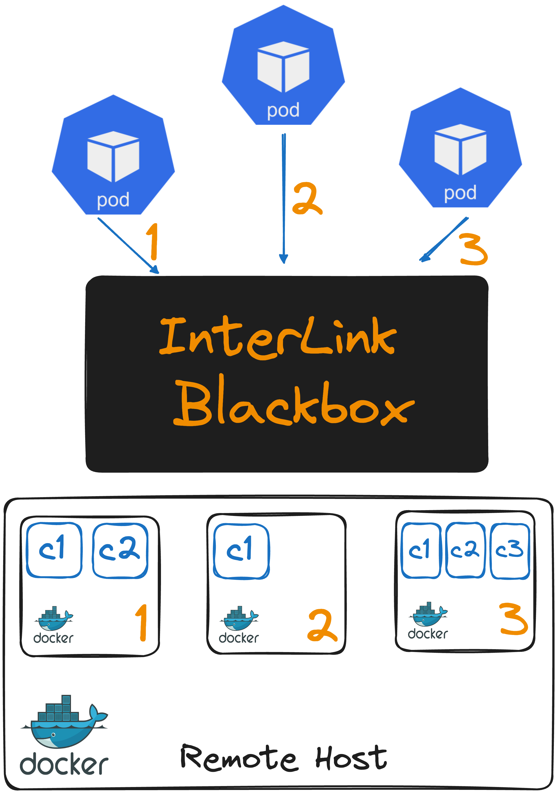

# Template for interTwin repositories

This repository is to be used as a repository template for creating a new interTwin
repository, and is aiming at being a clean basis promoting currently accepted
good practices.

It includes:

- License information
- Copyright and author information
- Code of conduct and contribution guidelines
- Templates for PR and issues
- Code owners file for automatic assignment of PR reviewers
- [GitHub actions](https://github.com/features/actions) workflows for linting
  and checking links

Content is based on:

- [Contributor Covenant](http://contributor-covenant.org)
- [Semantic Versioning](https://semver.org/)
- [Chef Cookbook Contributing Guide](https://github.com/chef-cookbooks/community_cookbook_documentation/blob/master/CONTRIBUTING.MD)

## GitHub repository management rules

All changes should go through Pull Requests.

### Merge management

- Only squash should be enforced in the repository settings.
- Update commit message for the squashed commits as needed.

### Protection on main branch

To be configured on the repository settings.

- Require pull request reviews before merging
  - Dismiss stale pull request approvals when new commits are pushed
  - Require review from Code Owners
- Require status checks to pass before merging
  - GitHub actions if available
  - Other checks as available and relevant
  - Require branches to be up to date before merging
- Include administrators

---
## Build docker image

Clone the repository with the following command:

```bash
git clone https://github.com/interTwin-eu/interlink-docker-plugin.git && cd interlink-docker-plugin
```

and run the following command to build the docker image:

```bash
docker build . -t  <image_name>:<tag> -f docker/Dockerfile.sidecar-docker 
```

---
## Build the plugin executable

To build the plugin executable, clone the repository and run the makefile:

```bash
git clone https://github.com/interTwin-eu/interlink-docker-plugin.git && cd interlink-docker-plugin && make 
```

## Docker plugin logic and configuration

An Interlink plugin is the last component of the InterLink chain (check here the InterLink flow ...). 
In particular, the docker plugin is responsible for executing the requests coming from the InterLink server, i.e. the requests to create, delete, logs and status of a POD, as docker containers.
There are two main versions of the plugin that correspond with two different branches of the repository: the main and the 2-light-version-no-gpu.
The main version of the plugin supports the creation of docker containers with GPU support, while the 2-light-version-no-gpu does not support GPU. In the first case, to build the binary executable, the following command should be used:

```bash
CGO_ENABLED=1 GOOS=linux go build -o bin/docker-sd cmd/main.go
```
As you can see, the CGO_ENABLED flag is set to 1, which means that the plugin will be built to allow the GO program to use C code. This is necessary to use the Nvidia GPU libraries.
In the second case, the command is the following:

```bash
CGO_ENABLED=0 GOOS=linux go build -o bin/docker-sd cmd/main.go
```
In this case, the CGO_ENABLED flag is set to 0, which means that the plugin will be built without the support of C code, and therefore without the support of Nvidia GPU libraries but with the advantage of a lighter version of the plugin.

When the docker plugin receives a create request from the InterLink server, it will first prepare and create all the necessary files to run the docker containers associated with the request. Then, it will use the docker API to create a DIND container (Docker in Docker) in which all the POD's containers will be executed.
Therefore, a POD request coming from the InterLink server will be translated into a DIND container. 
The reason for this choice is that the DIND container allows the plugin to execute the docker containers associated with the POD request in a controlled environment, without interfering with the host machine's docker containers. Moreover, to a DIND container a docker network is attached, which allows the containers to communicate with each other in a secure way, without exposing the ports to the host machine.
The docker images of the docker host are shared with the DIND container, so that the containers can be executed in the DIND container without the need to download them again.
Overall, even if the DIND container is a heavier solution that introduces an overhead in the execution of the containers, this choice is cleaner than running the containers directly on the host machine, as it allows the plugin to manage the containers in a more controlled way.
The following figure shows the architecture of the plugin:



When a delete request is received, the plugin will force the stop of the DIND container and remove it. The plugin will also remove all the files created for the POD request.
When a logs request is received, the plugin will return the logs of the specified container running in the DIND container.
When a status request is received, the plugin will return the status of the specified container running in the DIND container.
If you want to run the plugin as a binary executable, you first have to export the configuration file as an environment variable:

```bash
export INTERLINKCONFIGPATH=<path_to_config_file>
```
An example of configuration file can be the following:
```yaml
InterlinkURL: "http://127.0.0.1"
SidecarURL: "http://127.0.0.1"
InterlinkPort: "3000"
SidecarPort: "4000"
CommandPrefix: ""
ExportPodData: true
DataRootFolder: ".local/interlink/jobs/"
ServiceAccount: "interlink"
Namespace: "vk"
Tsocks: false
TsocksPath: "$WORK/tsocks-1.8beta5+ds1/libtsocks.so"
TsocksLoginNode: "login01"
BashPath: /bin/bash
VerboseLogging: true
ErrorsOnlyLogging: false
```
and then run the plugin with the following command:

```bash
./bin/docker-sd
```
